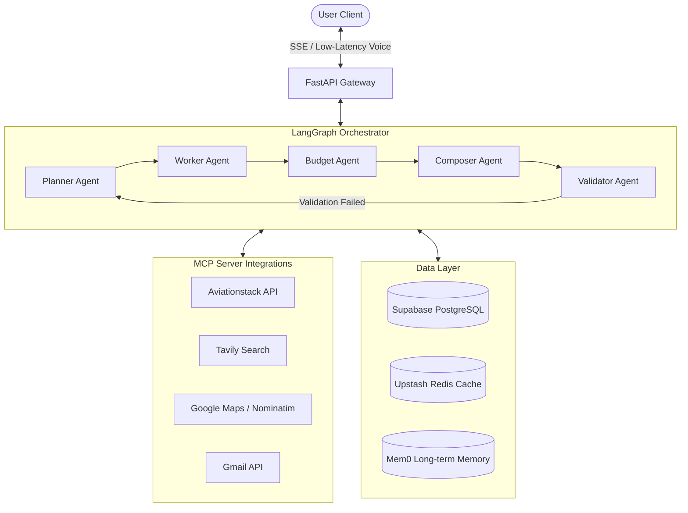

# Real-Time Voice AI Travel Planning Multi-Agent System

An AI-powered, voice-first travel planning platform utilizing a multi-agent LangGraph orchestration pipeline, Model Context Protocol (MCP) server integration, low-latency audio processing, and a Next.js web application.

---

## 🗺️ System Architecture & Orchestration

The system coordinates specialized agent workers to search, validate, and construct a personalized travel itinerary based on voice or text queries.



### Agent Roles:
1. **Planner Agent**: Parses raw requests and constraints to formulate a high-level day-by-day travel structure.
2. **Worker Agent**: Performs targeted searches for flights, hotels, and attractions via the MCP client.
3. **Budget Agent**: Computes pricing totals and optimizes costs to align with the user's budget.
4. **Composer Agent**: Crafts a premium markdown-formatted itinerary.
5. **Validator Agent**: Runs early-exit checks, validates feasibility, and signs off on constraints.

---

## 🛠️ Prerequisites & Setup

Ensure you have the following installed on your machine:
* **Python 3.11+**
* **Node.js 20+**
* **Docker Desktop** (optional, recommended for local PostgreSQL and Redis)

---

## 🚀 Quick Start (Local Docker Stack)

1. **Copy the Environment Template**:
   ```bash
   cp .env.example .env
   ```

2. **Spin up PostgreSQL, Redis, Frontend, and Backend**:
   ```bash
   docker-compose up --build
   ```

3. **Verify running statuses**:
   * **API Gateway**: [http://localhost:8000/health](http://localhost:8000/health)
   * **Next.js Frontend**: [http://localhost:3000](http://localhost:3000)

---

## 🐍 Native Backend Setup (Without Docker)

To run the backend gateway inside a native virtual environment:

1. **Navigate to the backend directory and create a virtualenv**:
   ```bash
   cd backend
   python -m venv .venv
   ```

2. **Activate the virtual environment**:
   * **Windows (PowerShell)**:
     ```powershell
     .\.venv\Scripts\Activate.ps1
     ```
   * **macOS/Linux**:
     ```bash
     source .venv/bin/activate
     ```

3. **Install Dependencies**:
   ```bash
   pip install -r requirements.txt
   ```
   *Note: On Windows, installing `webrtcvad` requires C++ Build Tools (MSVC Compiler).*

4. **Launch the Server**:
   ```bash
   python -m uvicorn app.main:app --host 0.0.0.0 --port 8000 --reload
   ```

5. **Run the Pytest Suite**:
   ```bash
   pytest
   ```

---

## ⚛️ Native Frontend Setup (Without Docker)

To run the Next.js web interface locally:

1. **Navigate to the frontend directory**:
   ```bash
   cd frontend
   ```

2. **Copy the Environment Template**:
   ```bash
   cp .env.local.example .env.local
   ```

3. **Install Node Packages & Run the Dev Server**:
   ```bash
   npm install
   npm run dev
   ```
   *Alternatively, start the server using the helper script:*
   ```bash
   node start-frontend.js
   ```

---

## 🧪 Phase-by-Phase Testing & Verification Guide

The codebase includes specific validation scripts (`scripts/run_phaseX.py`) that verify file architecture, run unit/integration suites, and enforce the exit criteria defined for each development phase.

### Phase 0: Scaffolding & DevOps Foundation
Verifies directory layout, logging wrappers, exception handling, and Docker configuration.
```bash
python scripts/run_phase0.py
```

### Phase 1: Data Layer & Authentication
Verifies PostgreSQL tables schema, Supabase authentication middleware, and session management.
```bash
python scripts/run_phase1.py
```

### Phase 2: MCP Client Middleware & Caching
Tests BaseMCP client structure, retries logic, rate limiters, caching layer, and Postgres audit logs.
```bash
python scripts/run_phase2.py
```

### Phase 3: Core Agent Pipeline
Validates LangGraph orchestration state, LLM token streaming, early-exit loops, and worker tool integrations.
```bash
python scripts/run_phase3.py
```

### Phase 4: Long-Term Memory & Personalization
Tests episodic/semantic memory persistence using Mem0 AI or Upstash Redis fallback stores.
```bash
python scripts/run_phase4.py
```

### Phase 5: Voice Pipeline (STT, TTS, and VAD)
Validates low-latency voice endpoints. Runs VAD chunking, transcribes audio via Groq Whisper API, and tests ElevenLabs text-to-speech generation with Gemini Voice fallback.
```bash
python scripts/run_phase5.py
```

### Phase 6: PDF Generation & Export
Verifies ReportLab PDF document building, styling, custom headers, and download response handshakes.
```bash
python scripts/run_phase6.py
```

### Phase 7: Managed Services Migration
Validates Upstash Redis connection endpoints, tests Supabase Postgres remote read/writes, and runs migration helper tests.
```bash
# Verify base production integrations
python scripts/run_phase7.py

# Verify managed Postgres and Upstash Redis configurations
python scripts/run_phase7A.py

# Verify end-to-end voice pipeline integrations in production
python scripts/run_phase7B.py
```

---

## 🎙️ Low-Latency Voice Flow (Phase 5)

The application features two voice operational modes:
* **⚡ Real-Time Mode**: Establishes continuous audio streams to stream prompt segments and receive spoken responses dynamically.
* **✏️ Edit Mode**: Records a single voice segment, transcribes it, and presents it in a text area for the user to edit before generating their travel plan.

### Fallback Audio Strategy
If the primary ElevenLabs voice generation fails or hits API rate limits, the backend automatically falls back to **Gemini Native Text-to-Speech** (using `models/gemini-2.5-flash-preview-tts` and voice `Zephyr`) to ensure the user always receives spoken guidance.

---

## ☁️ Production Deployment

See [doc/deployment_plan.md](doc/deployment_plan.md) for full instructions on deploying:
* **Backend**: Hosted on Render using a native **Python** Web Service connected to GitHub.
* **Frontend**: Hosted on Vercel using Next.js framework deployments.
* **Managed Cache**: Upstash Redis.
* **Managed Database**: Supabase PostgreSQL.

---

## 📄 License

This project is licensed under the MIT License — see the [LICENSE](LICENSE) file for details.
