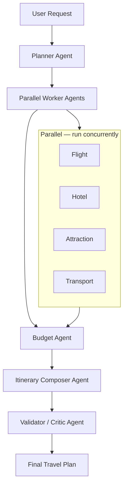

# Real-Time Voice AI Travel Planning Multi-Agent Systems — Problem Statement

## Executive Summary

Build a **production-grade, multi-agent travel planning platform** that turns a short natural-language request into a practical, personalized itinerary. The system must be **cost-efficient**, **low-latency**, **reliable**, **personalized**, and **grounded in real-world data**—with **voice** and **text** interaction.

---

## 1. Background

Trip planning sounds simple until you try to do it well. A single request like:

> *"Plan a 5-day trip to Japan—Tokyo and Kyoto. $3,000 budget. Love food and temples; hate crowds."*

forces the system to:

- Interpret goals, constraints, and preferences
- Research destinations and attractions
- Find flights and accommodations
- Plan inter-city and local transportation
- Stay within budget while personalizing recommendations
- Verify the final plan matches the request and is factually grounded
- Ask smart follow-up questions when information is incomplete

One monolithic agent struggles to do all of this at once. A **multi-agent architecture** assigns specialized roles, improving accuracy, reliability, and maintainability.

---

## 2. Objective

Design an **AI-powered Travel Planning Multi-Agent System** that automatically converts natural-language travel requests into actionable itineraries.

Success means demonstrating how specialized agents collaborate on a real-world planning problem while meeting production constraints: cost, latency, reliability, personalization, and grounding.

---

## 3. User Problem & Expected Output

### 3.1 Input

Users provide requests via **voice** or **text** (editable transcripts). Example:

> *"Plan a 5-day trip to Japan. Tokyo + Kyoto. $3,000 budget. Love food and temples, hate crowds."*

### 3.2 Output

The system produces a **complete travel plan**, including:

| Category | Deliverables |
|----------|--------------|
| **Itinerary** | Day-by-day schedule, recommended attractions, suggested neighborhoods |
| **Lodging & transport** | Hotel recommendations, local routes, inter-city logistics |
| **Budget** | Cost breakdown, budget-aware options |
| **Personalization** | Final plan aligned with travel style, food, crowd tolerance, accommodation and transport preferences, and prior trips or stored preferences |

### 3.3 Voice Experience

- Natural voice conversations
- Editable text fallback
- **Concise voice summaries** of the trip (not full itinerary read-aloud)
- Generate downloadable full itinerary report

---

## 4. Functional Requirements

### 4.1 Authentication

- Email + password
- Google OAuth

### 4.2 Trip Planning

- Flight discovery
- Hotel and attraction recommendations
- Route calculation and travel-time estimates
- Budget-aware itinerary generation
- One-click downloadable itinerary report generation (PDF)
- Automated itinerary and trip summary delivery to the user's registered email

### 4.3 Personalization (Long-Term Memory)

Remember and apply:

- Food preferences (e.g., vegetarian)
- Travel style and crowd tolerance (e.g., dislikes crowds)
- Accommodation preferences (e.g., budget hotels)
- Activity preferences (e.g., museums over nightlife)
- Transportation preferences
- Previous trips and stored user profiles

### 4.4 Follow-Up Questions (Travel Discovery Agent)

A dedicated agent asks the **minimum** questions needed for a useful plan:

| Rule | Detail |
|------|--------|
| One question at a time | Avoid questionnaire-style UX |
| Prioritize critical gaps | Dates, budget, travelers before nice-to-haves |
| Plan early | Start when sufficient info exists |
| Reuse memory | Prefer stored preferences over re-asking |

**Good:** User says *"I want to visit Japan."* → Agent: *"What dates are you considering?"*

**Bad:** Asking for dates, budget, hotel type, food, transport, travelers, and accommodation in one message.

---

## 5. Multi-Agent Architecture

### 5.1 Pattern: Manager–Worker with Sequential Synthesis



**Parallel phase:** Flight, Hotel, Attraction, and Transport agents run concurrently to reduce latency.

**Sequential phase:** After all workers complete, the **Budget Agent** aggregates costs and checks compliance, then the **Itinerary Composer** assembles the draft plan and hands it to the **Validator**.

### 5.2 Planner Agent

- Understand user intent
- Extract constraints
- Create execution plans
- Delegate tasks to specialist agents

### 5.3 Worker Agents (Parallel)

| Agent | Responsibilities | Tools (via MCP) |
|-------|------------------|-----------------|
| **Flight** | Discovery, validation | AviationStack API |
| **Hotel** | Recommendations, verification | Tavily Search |
| **Attraction** | Discovery, validation | Tavily Search |
| **Transport** | Routes, travel times, transit | GraphHopper, OSRM (Routing) & Photon,Nominatim (Geocoding) |

### 5.4 Budget Agent (Sequential)

Runs **after** all parallel workers finish. It does not start until worker outputs are available.

- Aggregate estimated costs (flights, hotels, activities, transport)
- Compare totals against the user’s budget constraint
- Flag over-budget items and suggest adjustments
- Emit a budget compliance report for downstream agents

### 5.5 Itinerary Composer Agent (Sequential)

Runs **after** the Budget Agent.

- Merge worker outputs and budget report into a coherent day-by-day itinerary
- Apply personalization and scheduling logic (e.g., crowd-averse timing)
- Produce a structured draft itinerary for validation
- Report the composed plan to the Validator / Critic Agent

### 5.6 Validator / Critic Agent

Receives the composed itinerary from the Itinerary Composer.

- Validate overall plan quality and completeness
- Re-check budget compliance and user preferences
- Detect conflicts (e.g., overlapping cities same morning)
- Ensure factual grounding (e.g., places exist on Maps)
- Approve, reject, or request revision before delivery to the user

### 5.7 Agent Reasoning & Prompting

#### Reasoning: Graph of Thought (GoT)

Agents use **Graph of Thought (GoT)** reasoning—not linear chain-of-thought alone. Planning steps form a graph of hypotheses, tool results, and revisions so the Planner and workers can branch, backtrack, and merge paths when constraints conflict (e.g., budget vs. preferred hotel).

#### Prompting Principles

| Principle | Meaning |
|-----------|---------|
| **Constraint-first planning** | Budget, dates, and hard limits before nice-to-haves |
| **Grounded responses only** | Claims backed by tool output or verified data |
| **Tool-assisted reasoning** | Prefer MCP tool calls over speculation |
| **Preference-aware recommendations** | Apply Mem0 and episodic memory when ranking options |
| **Budget-aware optimization** | Budget Agent enforces limits before composition |
| **Validation before final output** | No user-facing plan without Validator approval |

#### Tone & Interaction Style

- Professional and friendly
- Clear and concise communication
- Ask **one** follow-up question at a time (see §4.4)
- Avoid overwhelming users with excessive detail
- Provide actionable recommendations

---

## 6. Technology Stack

| Layer | Choices |
|-------|---------|
| **Orchestration** | LangGraph |
| **Backend** | FastAPI, AsyncIO |
| **Tool integration** | Model Context Protocol (MCP) — standardized agent ↔ tool interface |
| **Auth & data** | Supabase (PostgreSQL): users, profiles, itineraries, chat, episodic memory |
| **Cache** | Upstash Redis: sessions, flight/hotel cache, agent state, intermediate results |
| **Personalization** | Mem0 (long-term preferences and habits) |
| **Conversation state** | LangGraph State + Redis (short-term) |
| **STT** | Groq Whisper API (``whisper-large-v3-turbo``) + WebRTC VAD |
| **TTS** | ElevenLabs (summary-only audio) |

### 6.1 Tool Integration Layer (MCP)

**Model Context Protocol (MCP)** is the standardized interface between agents and external tools. All worker agents invoke flights, search, maps, and related APIs through MCP servers—not ad hoc HTTP wrappers per agent.

Benefits:

- Consistent tool schemas and error handling across agents
- Easier swapping providers in development
- Centralized auth, rate limiting, and audit hooks at the MCP layer

### 6.2 LLM Model Assignment (Dual-Brain Design)

Two model families deliberately split **research/synthesis** from **budget/validation** so the system is not a single homogeneous “brain”:

| Agent group | Model | Rationale |
|-------------|-------|-----------|
| **Planner**, **Flight**, **Hotel**, **Attraction**, **Transport**, **Itinerary Composer** | **Groq** | Fast, cost-efficient research and option generation |
| **Budget Agent**, **Validator / Critic** | **Gemini** | Stronger structured reasoning for arithmetic, compliance, and critique |

This dual-brain layout pairs speed on discovery with rigor on numbers and final checks.

### 6.3 Memory Model

| Type | Purpose | Examples | Storage |
|------|---------|----------|---------|
| **Short-term** | Active conversation & planning session | Current trip, in-progress plan | LangGraph State, Redis |
| **Long-term** | Personalization | Food style, hotel prefs | Mem0 |
| **Episodic** | Past travel experiences | Japan, Thailand, Europe trips | PostgreSQL (Supabase) |

### 6.4 External APIs (MCP Servers-Backed) 

| API integrated by MCP Server | Use |
|------------------------------|-----|
| **Tavily Search (via MCP)** | Destinations, attractions, hotels, restaurants |
| **AviationStack (via MCP)** | Flight discovery |
| **GraphHopper / OSRM (via MCP)** | Transit routing and quick travel-time calculation |
| **Nominatim (via MCP)** | geocoding and location validation |
| **Gmail (via MCP)** | Itinerary and summary delivery |

---

## 7. Cost, Latency & Reliability

### 7.1 Cost Controls

- Tool response caching (flights, hotels, plan templates)
- Per-agent step limits (e.g., Planner: 5, Worker: 3, Budget: 2, Composer: 3, Validator: 2)

### 7.2 Latency Controls

- Parallel worker execution
- Async tool calls
- Cached plans and search results

**Target:** typical end-to-end response **&lt; 5 seconds**.

### 7.3 Reliability

| Mechanism | Behavior |
|-----------|----------|
| **Retry** | API timeouts, transient network errors, rate limits |
| **Graceful degradation** | If flights fail, continue hotels/attractions; inform user |
| **Fallback chain** | Tool result → fallback search → user clarification |

---

## 8. Failure Modes & Mitigations

| Failure mode | Example | Mitigation |
|--------------|---------|------------|
| Planner hallucination | Impossible execution plan | Plan validation |
| Plan drift | Deviates from user goal | Constraint checks |
| Context drift | Loses conversation thread | Structured state tracking |
| Silent failure | Tool fails without signal | Health checks, status reporting |
| Memory drift | Stale preferences applied | Memory freshness scoring |
| Premature completion | Stops before plan is ready | Completion checklist |
| Hallucinated attractions | Non-existent temple | Maps verification |
| Budget violation | $3,000 budget → $4,500 plan | Budget Agent + Validator hard checks |
| Conflicting plans | Kyoto and Tokyo same morning | Travel-time validation |
| Preference drift | Crowds-averse user → crowded venue | Preference validator |
| Tool failure | API unavailable | Retry + fallback |
| ASR errors | Wrong transcription | Editable transcript |
| High latency | Slow planning | Parallel execution + caching |

---

## 9. Safety & Guardrails

### 9.1 Input

Validate user inputs: dates, budgets, destinations, airport codes.

### 9.2 Tools

Validate arguments and outputs; defend against prompt injection and malicious tool responses.

### 9.3 Output

Verify groundedness, budget compliance, user constraints, and safety policies.

---

## 10. Evaluation & Observability

### 10.1 Golden Dataset

Evaluate against a **Golden Travel Request Dataset**.

### 10.2 Metrics

| Category | Metrics |
|----------|---------|
| **Quality** | Constraint satisfaction, preference alignment, completeness, groundedness |
| **Agents** | Tool selection accuracy, tool success rate, validation accuracy, plan accuracy |
| **System** | End-to-end latency, cost per task, cache hit rate, retry rate, failure rate |

### 10.3 Audit Logging

All agent actions must be logged (trace ID, agent, model, tool, arguments, result, latency, cost, cache hit). Example:

```json
{
  "timestamp": "2024-11-01T14:32:00Z",
  "trace_id": "abc123",
  "agent": "flight_agent",
  "model": "gemini",
  "tool": "search_flights",
  "arguments": { "origin": "JFK", "destination": "SFO" },
  "result": { "status": "success", "flights_found": 12 },
  "latency_ms": 850,
  "cost_usd": 0.003,
  "cache_hit": false
}
```

---

## 11. Non-Functional Requirements

| Area | Target |
|------|--------|
| **Reliability** | ≥ 99% successful task completion |
| **Scalability** | Horizontally scalable worker agents |
| **Latency** | Typical response &lt; 5 seconds |
| **Cost** | Aggressive caching and tool reuse |
| **Security** | OAuth, input validation, prompt-injection defenses |
| **Maintainability** | Strict JSON schemas, modular agents, centralized observability |

---

## 12. Future Enhancements

### 12.1 Payments & Booking

Integrate real booking and payment flows.

### 12.2 Agentic RAG

Augment planning with structured knowledge from Wikivoyage, destination guides, visa rules, and local customs:

```text
Scrape → Clean → Chunk → Index → RAG Retrieval
```

**Real-time** data (flights, places, routes) remains on Tavily, AviationStack, and Google Maps—not static RAG alone.

---

## Document History

| Version | Focus |
|---------|--------|
| Enhanced | Multi-agent architecture, voice, memory tiers, guardrails, evaluation framework |
| Enhanced+ | Budget & Itinerary Composer agents, MCP tool layer, GoT prompting, Groq/Gemini split |
