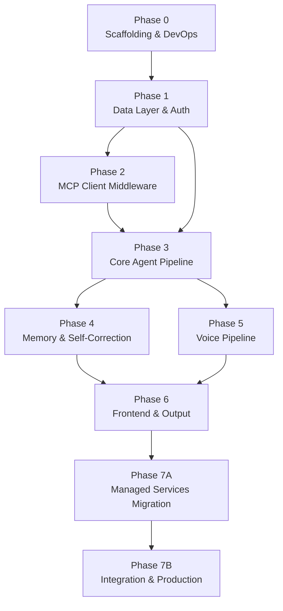
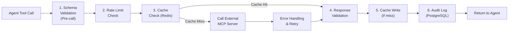
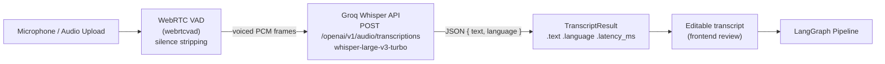
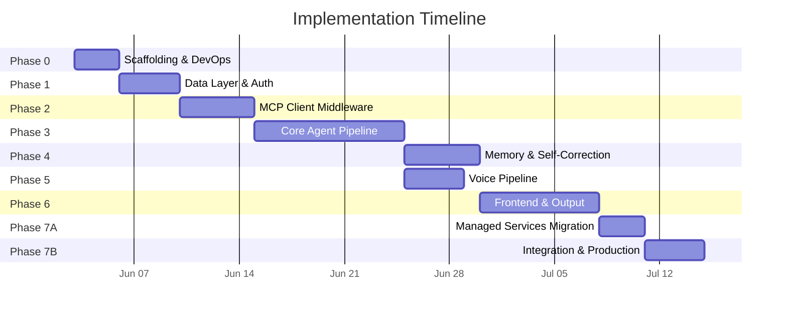

# Real-Time Voice AI Travel Planning Multi-Agent System — Phase-Wise Implementation Plan

> **Author:** Shiv
> **Date:** 2026-06-02
> **Status:** Implementation Blueprint
> **Source Docs:** [architecture.md](architecture.md) · [enhancedProblemStatement.md](enhancedProblemStatement.md) · [AIProductStrategy.md](AIProductStrategy.md)
> **Companion Files:** [eval.md](eval.md) (Testing & Exit Criteria) · [decision.md](decision.md) (Architecture Decision Records)

---

## Table of Contents

1. [Implementation Overview](#1-implementation-overview)
2. [Phase 0 — Project Scaffolding & DevOps Foundation](#2-phase-0--project-scaffolding--devops-foundation)
3. [Phase 1 — Data Layer & Authentication](#3-phase-1--data-layer--authentication)
4. [Phase 2 — MCP Client Middleware & Tool Integration](#4-phase-2--mcp-client-middleware--tool-integration)
5. [Phase 3 — Core Agent Pipeline (LangGraph Orchestration)](#5-phase-3--core-agent-pipeline-langgraph-orchestration)
6. [Phase 4 — Memory, Personalization & Self-Correcting Loop](#6-phase-4--memory-personalization--self-correcting-loop)
7. [Phase 5 — Voice Pipeline (STT + TTS)](#7-phase-5--voice-pipeline-stt--tts)
8. [Phase 6 — Frontend & Output Generation](#8-phase-6--frontend--output-generation)
9. [Phase 7A — Managed Services Migration (Supabase + Upstash)](#9-phase-7a--managed-services-migration-supabase--upstash)
10. [Phase 7B — Integration Testing, Optimization & Production Readiness](#10-phase-7b--integration-testing-optimization--production-readiness)
11. [Cross-Phase: Evaluation & Decision Tracking](#11-cross-phase-evaluation--decision-tracking)
12. [Master Timeline Summary](#12-master-timeline-summary)

---

## 1. Implementation Overview

### 1.1 Guiding Principles

| Principle | How Applied |
|-----------|-------------|
| **Bottom-up build** | Data layer → Tool layer → Agent layer → Memory → Voice → Frontend → Polish |
| **Dependency-first ordering** | Each phase builds only on what's already completed; no forward dependencies |
| **MCP Client before Agents** | All tool integrations (schema validation, retry, rate limiting, caching, audit) must be solid before any agent calls external MCP servers |
| **Test-at-every-phase** | Each phase has a dedicated eval file with exit criteria; no phase is "done" until exit criteria pass |
| **Decision-tracked** | All tech/business decisions captured in [decision.md](decision.md) with context, options, and rationale |

### 1.2 Phase Dependency Graph



### 1.3 Tech Stack Summary (from Architecture)

| Layer | Technology |
|-------|-----------|
| Backend | FastAPI + AsyncIO (Python 3.11+) |
| Orchestration | LangGraph + LangChain |
| LLMs | Groq (research/synthesis) + Gemini (budget/validation) |
| Tool Integration | MCP Clients (this project) → External MCP Servers (separate project) |
| Auth | Supabase Auth (Email/Password + Google OAuth) |
| Database | Supabase PostgreSQL |
| Cache | Upstash Redis |
| Long-Term Memory | Mem0 |
| STT | Groq Whisper API (``whisper-large-v3-turbo``) + WebRTC VAD |
| TTS | ElevenLabs |
| Frontend | Next.js 14+ (App Router, TypeScript, Tailwind CSS) — desktop-first responsive |

---

## 2. Phase 0 — Project Scaffolding & DevOps Foundation

**Goal:** Establish project structure, development environment, foundational configs, and phase verification scripts so all subsequent phases have a clean workspace.

**Duration:** 2–3 days

**Depends On:** Nothing (starting point)

> [!NOTE]
> **Git init and CI pipeline are deferred to Phase 7** (final stage). Phase 0 focuses on local scaffolding only.

---

### 2.1 Tasks

| # | Task | Detail |
|---|------|--------|
| 0.1 | Create project directory structure | Match [architecture.md §17](architecture.md) final-state layout |
| 0.2 | Set up Python environment | Python 3.11+, virtual env, `requirements.txt` with pinned versions |
| 0.3 | Create FastAPI skeleton | `main.py` with health check, CORS, middleware |
| 0.4 | Create Pydantic config | `config.py` with `APP_ENV=local|staging|production`; **local** uses `DATABASE_URL` + `REDIS_URL` (Docker); **production** uses Supabase + Upstash |
| 0.5 | Set up `.env.example` | Document **local** vars (`DATABASE_URL`, `REDIS_URL`, `APP_ENV=local`) and **production** vars (`SUPABASE_*`, `UPSTASH_*`) — see [architecture.md §15.2](architecture.md) |
| 0.6 | Docker Compose for local dev | `postgres` + **`redis`** — local database and cache for Phases 0–6 |
| 0.7 | Add Postgres init script | `docker/postgres/init.sql` — create `travel_db` database on first start |
| 0.8 | Initialize Next.js frontend skeleton | `npx create-next-app@latest` — App Router, TypeScript, Tailwind CSS; placeholder page |
| 0.9 | Create `.gitignore` | Python, Node, `.next`, `.env`, `__pycache__`, `.mypy_cache` |
| 0.10 | Create `README.md` | Project overview, local Docker setup for postgres/redis (`docker-compose up`), backend venv setup, frontend npm setup, `APP_ENV` switching, architecture link |
| 0.11 | Set up structured JSON logging utility | `utils/logging.py` — structured logs with trace ID support |
| 0.12 | Set up trace ID generation utility | `utils/tracing.py` — unique trace IDs per request |
| 0.13 | Set up custom error classes | `utils/errors.py` — base exceptions for agents, tools, validation |
| 0.14 | Create input validators utility | `utils/validators.py` — date, budget, destination validation |
| 0.15 | Create phase verification script framework | `scripts/run_phase0.py` … `scripts/run_phase7B.py` + `scripts/_phase_common.py` |

> **Decision → [decision.md](decision.md):** `DEC-001`, `DEC-002`, `DEC-031`, **`DEC-032`** — Local Docker Postgres/Redis for dev; managed migration in Phase 7

---

### 2.2 Files Created

```
Real-Time-Voice-AI-Travel-Planning-Multi-Agent-System/
│
├── 📁 backend/
│   ├── 📁 app/
│   │   ├── __init__.py
│   │   ├── main.py                          # FastAPI entry point, health check, CORS, middleware
│   │   ├── config.py                        # Pydantic settings, environment config
│   │   │
│   │   └── 📁 utils/
│   │       ├── __init__.py
│   │       ├── logging.py                   # Structured JSON logging with trace ID
│   │       ├── tracing.py                   # Trace ID generation & propagation
│   │       ├── errors.py                    # Custom exception classes
│   │       └── validators.py               # Input validation helpers
│   │
│   ├── 📁 tests/
│   │   └── __init__.py
│   │
│   ├── requirements.txt                     # Pinned Python dependencies
│   └── .env.example                         # Environment variable template
│
├── 📁 frontend/                             # Next.js app (initialized Phase 0, built Phase 6)
│   ├── package.json
│   ├── next.config.ts
│   ├── tsconfig.json
│   ├── tailwind.config.ts
│   ├── .env.local.example                   # NEXT_PUBLIC_API_URL, Supabase public keys
│   └── src/app/page.tsx                     # Placeholder landing page
│
├── 📁 doc/
│   ├── problemStatement.md
│   ├── enhancedProblemStatement.md
│   ├── AIProductStrategy.md
│   ├── architecture.md
│   ├── phase-wise-implementationPlan.md     # ← This document
│   ├── eval.md                              # Testing & exit criteria
│   └── decision.md                          # Architecture Decision Records
│
├── 📁 scripts/
│   ├── _phase_common.py                     # Shared helpers for phase verification scripts
│   ├── run_phase0.py                        # Verify Phase 0 scaffolding
│   ├── run_phase1.py                        # Verify Phase 1 data layer & auth
│   ├── run_phase2.py                        # Verify Phase 2 MCP clients
│   ├── run_phase3.py                        # Verify Phase 3 agent pipeline
│   ├── run_phase4.py                        # Verify Phase 4 memory & self-correction
│   ├── run_phase5.py                        # Verify Phase 5 voice pipeline
│   ├── run_phase6.py                        # Verify Phase 6 Next.js frontend & output
│   ├── run_phase7A.py                       # Verify Phase 7A managed services migration
│   └── run_phase7B.py                       # Verify Phase 7B integration & production readiness
│
├── 📁 docker/
│   └── 📁 postgres/
│       └── init.sql                         # Create travel_db on first container start
│
├── docker-compose.yml                       # Local dev: postgres + redis only
├── .env.example                             # APP_ENV=local + DATABASE_URL + REDIS_URL (+ production vars commented)
├── .gitignore
├── LICENSE
└── README.md
```

### 2.3 Exit Criteria → [eval.md](eval.md)

| Criteria | Validation |
|----------|-----------|
| `docker-compose up` runs **postgres** + **redis** for local dev | Manual verification |
| Backend starts with `uvicorn` in venv and returns `{"status": "ok"}` with `APP_ENV=local` | Automated test |
| Next.js dev server starts (`npm run dev` in `frontend/`) | Manual verification |
| `python scripts/run_phase0.py` passes all Phase 0 checks | Phase verification script |
| `.env.example` documents local (`DATABASE_URL`, `REDIS_URL`) and production (`SUPABASE_*`, `UPSTASH_*`) vars | Manual review |
| Structured logging outputs valid JSON with trace IDs | Unit test |
| Custom error classes are importable and testable | Unit test |
| Input validators correctly validate dates, budgets, destinations | Unit tests (≥10 cases) |

---

## 3. Phase 1 — Data Layer & Authentication

**Goal:** Establish all data persistence (PostgreSQL schemas, Redis cache, Supabase Auth) so agents and APIs can read/write data from Phase 2 onward.

**Duration:** 3–4 days

**Depends On:** Phase 0

---

### 3.1 Tasks

| # | Task | Detail |
|---|------|--------|
| 1.1 | Set up Supabase project (auth only for now) | Create Supabase project for Auth/OAuth; **data stays on local PostgreSQL** until Phase 7 migration |
| 1.2 | Run Database Schema DDL on **local PostgreSQL** | Execute `001_initial_schema.sql` against Docker `postgres` service |
| 1.3 | Configure Row Level Security (RLS) | Define RLS policies in migration SQL; **enforce on Supabase after Phase 7 migration**; local dev uses app-level `user_id` filtering |
| 1.4 | Wire Redis session manager to **local Redis** | `memory/session.py` — uses `REDIS_URL=redis://redis:6379` from `.env` |
| 1.5 | Create Pydantic data models | `models/user.py`, `models/trip.py`, `models/itinerary.py`, `models/budget.py`, `models/agent.py` |
| 1.6 | Implement Supabase Auth wrapper | `services/auth.py` — JWT verification, user registration, login, Google OAuth |
| 1.7 | Create auth API routes | `routers/auth.py` — `POST /auth/register`, `POST /auth/login`, `POST /auth/google`, `GET /auth/me` |
| 1.8 | Create auth middleware | JWT verification middleware for protected routes |
| 1.9 | Create database seed script | `scripts/seed_db.py` — seeds **local PostgreSQL** with test users and sample trips |
| 1.10 | Write unit tests for data models | Pydantic model validation, serialization, edge cases |
| 1.11 | Write integration tests for auth flow | Register → login → JWT → protected route (against local stack) |

> **Decision → [decision.md](decision.md):** `DEC-004`, `DEC-005`, `DEC-006`, **`DEC-032`** — Local Postgres/Redis through Phase 6; Supabase/Upstash after Phase 7 migration

---

### 3.2 Files Created

```
backend/
├── 📁 app/
│   ├── 📁 models/                           # Pydantic schemas & data models
│   │   ├── __init__.py
│   │   ├── user.py                          #   User, Profile, AuthResponse schemas
│   │   ├── trip.py                          #   Trip, Constraints, Preferences schemas
│   │   ├── itinerary.py                     #   Itinerary, DayPlan, Activity schemas
│   │   ├── budget.py                        #   BudgetBreakdown, ComplianceReport schemas
│   │   └── agent.py                         #   AgentResponse, ToolResult schemas
│   │
│   ├── 📁 routers/
│   │   ├── __init__.py
│   │   ├── auth.py                          #   Auth routes (register, login, OAuth, me)
│   │   └── health.py                        #   Health check endpoint
│   │
│   ├── 📁 services/
│   │   ├── __init__.py
│   │   └── auth.py                          #   Supabase Auth wrapper (JWT, OAuth)
│   │
│   └── 📁 memory/
│       ├── __init__.py
│       └── session.py                       #   Redis session state management
│
├── 📁 tests/
│   ├── 📁 unit/
│   │   └── test_models.py                   #   Data model validation tests
│   └── 📁 integration/
│       └── test_auth.py                     #   Auth flow integration tests
│
└── 📁 supabase/
    └── migrations/
        └── 001_initial_schema.sql           #   Database DDL (all 6 tables + RLS)

scripts/
└── seed_db.py                               #   Database seed data
```

### 3.3 Exit Criteria → [eval.md](eval.md)

| Criteria | Validation |
|----------|-----------|
| `python scripts/run_phase1.py` passes all Phase 1 checks | Phase verification script |
| All 6 database tables created and RLS enforced | SQL query + RLS test |
| User can register with email/password | Integration test |
| User can login and receive valid JWT | Integration test |
| Google OAuth flow returns valid JWT | Manual test |
| JWT middleware blocks unauthenticated requests | Integration test |
| Redis session read/write works with TTL expiry | Unit test |
| All Pydantic models validate correctly (valid + invalid inputs) | Unit tests (≥20 cases) |
| Seed script populates test data successfully | Script execution test |

---

## 4. Phase 2 — MCP Client Middleware & Tool Integration

**Goal:** Build the MCP Client middleware layer that enforces **schema validation, error handling & retry, rate limiting, response caching, and audit logging** before ANY call to an external MCP server. This is the critical prerequisite before any agent can call external tools.

**Duration:** 4–5 days

**Depends On:** Phase 1 (Redis for caching, PostgreSQL for audit logging)

> [!IMPORTANT]
> **MCP Servers are NOT part of this project.** They are hosted externally in a separate project. This phase builds only the **MCP Client** with its 5-layer middleware stack. Every outbound tool call MUST pass through this middleware — no agent bypasses this layer.

---

### 4.1 Tasks

| # | Task | Detail |
|---|------|--------|
| 2.1 | Design MCP Client middleware architecture | Define middleware chain: Schema Validation → Rate Limiting → Cache Check → External Call → Response Validation → Cache Write → Audit Log |
| 2.2 | Implement `BaseMCPClient` | `mcp_clients/base.py` — abstract base class with all 5 middleware layers |
| 2.3 | Implement Schema Validation layer | Pre-call argument validation + post-call response validation against JSON schemas |
| 2.4 | Implement Error Handling & Retry layer | Exponential backoff (max 3 retries), transient error detection (timeout, rate limit, 5xx) |
| 2.5 | Implement Rate Limiting layer | Per-API rate limit enforcement using Redis counters; configurable limits per external MCP server |
| 2.6 | Implement Response Caching layer | Redis-based caching with configurable TTL per API (flights: 1h, hotels: 1h, attractions: 24h, geocoding: 7d, routes: 24h) |
| 2.7 | Implement Audit Logging layer | Log every tool call to PostgreSQL `audit_log` table with trace_id, agent, tool, arguments, result, latency_ms, cost_usd, cache_hit |
| 2.8 | Implement AviationStack MCP Client | `mcp_clients/aviationstack.py` — flight search, availability; extends `BaseMCPClient` |
| 2.9 | Implement Tavily Search MCP Client | `mcp_clients/tavily.py` — destination, hotel, attraction search; extends `BaseMCPClient` |
| 2.10 | Implement GraphHopper/OSRM MCP Client | `mcp_clients/graphhopper.py` — route calculation, travel-time estimation; extends `BaseMCPClient` |
| 2.11 | Implement Nominatim MCP Client | `mcp_clients/nominatim.py` — geocoding, location existence validation; extends `BaseMCPClient` |
| 2.12 | Implement Gmail MCP Client | `mcp_clients/gmail.py` — email delivery; extends `BaseMCPClient` |
| 2.13 | Define tool schemas (JSON Schema) | Create strict schemas for every tool's arguments and responses |
| 2.14 | Write unit tests for middleware layers | Schema validation, retry logic, rate limiting, cache hit/miss, audit logging |
| 2.15 | Write integration tests for MCP Clients | Real API calls through middleware chain (mock MCP servers for CI) |

> **Decision → [decision.md](decision.md):** `DEC-007` — MCP Client vs MCP Server (external), `DEC-008` — Cache TTL strategy per API, `DEC-009` — Rate limit thresholds per API, `DEC-010` — Retry backoff strategy (exponential with jitter)

---

### 4.2 MCP Client Middleware Execution Order



---

### 4.3 Files Created

```
backend/app/
├── 📁 mcp_clients/                          # MCP Client middleware layer
│   ├── __init__.py
│   ├── base.py                              #   BaseMCPClient — 5-layer middleware stack
│   ├── aviationstack.py                     #   AviationStack MCP Client (flight search)
│   ├── tavily.py                            #   Tavily Search MCP Client (hotels, attractions)
│   ├── graphhopper.py                       #   GraphHopper / OSRM MCP Client (routing)
│   ├── nominatim.py                         #   Nominatim MCP Client (geocoding)
│   ├── gmail.py                             #   Gmail MCP Client (email delivery)
│   │
│   └── 📁 schemas/                          #   JSON schemas for tool validation
│       ├── aviationstack_schemas.json        #     Flight search argument/response schemas
│       ├── tavily_schemas.json              #     Search argument/response schemas
│       ├── graphhopper_schemas.json         #     Route argument/response schemas
│       ├── nominatim_schemas.json           #     Geocoding argument/response schemas
│       └── gmail_schemas.json               #     Email argument/response schemas

backend/tests/
├── 📁 unit/
│   ├── test_mcp_base.py                     #   Middleware layer unit tests
│   ├── test_schema_validation.py            #   Schema validation tests
│   ├── test_rate_limiting.py                #   Rate limit enforcement tests
│   └── test_caching.py                      #   Cache hit/miss tests
└── 📁 integration/
    └── test_mcp_clients.py                  #   End-to-end MCP Client tests (mocked external)
```

### 4.4 Exit Criteria → [eval.md](eval.md)

| Criteria | Validation |
|----------|-----------|
| `python scripts/run_phase2.py` passes all Phase 2 checks | Phase verification script |
| `BaseMCPClient` enforces all 5 middleware layers in correct order | Unit test |
| Schema validation rejects invalid tool arguments (≥10 invalid cases per API) | Unit tests |
| Schema validation rejects malformed API responses | Unit tests |
| Retry logic retries exactly 3 times on transient errors, then fails | Unit test |
| Rate limiter blocks calls when rate limit is exceeded | Unit test + Redis counter verification |
| Cache returns cached responses and skips external call | Unit test + Redis key verification |
| Cache TTL matches configured values (1h, 24h, 7d) | Unit test |
| Audit log writes complete records to PostgreSQL `audit_log` table | Integration test + DB query |
| Each MCP Client (AviationStack, Tavily, GraphHopper, Nominatim, Gmail) can make a successful call through the middleware | Integration tests (5 tests) |
| All tool schemas are valid JSON Schema and correctly validate real API payloads | Schema validation tests |

---

## 5. Phase 3 — Core Agent Pipeline (LangGraph Orchestration)

**Goal:** Build the full 8-agent LangGraph pipeline: Planner → Parallel Workers (Flight, Hotel, Attraction, Transport) → Budget Agent → Itinerary Composer → Validator. Text-only input; no voice yet.

**Duration:** 7–10 days

**Depends On:** Phase 1 (data models) + Phase 2 (MCP Clients)

---

### 5.1 Tasks

| # | Task | Detail |
|---|------|--------|
| 3.1 | Define `TravelPlanState` TypedDict | `graph/state.py` — all state keys from [architecture.md §4.3](architecture.md) |
| 3.2 | Implement `BaseAgent` class | `agents/base.py` — shared agent behavior: model selection, step limits, error handling, logging |
| 3.3 | Implement Planner Agent | `agents/planner.py` — intent parsing, constraint extraction, delegation plan creation |
| 3.4 | Implement Flight Agent | `agents/flight.py` — flight search via AviationStack MCP Client, result filtering |
| 3.5 | Implement Hotel Agent | `agents/hotel.py` — hotel discovery via Tavily MCP Client, preference filtering |
| 3.6 | Implement Attraction Agent | `agents/attraction.py` — POI discovery via Tavily + existence validation via Nominatim |
| 3.7 | Implement Transport Agent | `agents/transport.py` — route calculation via GraphHopper + geocoding via Nominatim |
| 3.8 | Implement Budget Agent | `agents/budget.py` — cost aggregation, budget compliance, auto-optimization (Gemini) |
| 3.9 | Implement Itinerary Composer Agent | `agents/composer.py` — day-by-day schedule assembly, geo-clustering, meal scheduling (Groq) |
| 3.10 | Implement Validator / Critic Agent | `agents/validator.py` — quality checks, conflict detection, factual grounding (Gemini) |
| 3.11 | Implement LangGraph node functions | `graph/nodes.py` — wrapper functions for each agent as graph nodes |
| 3.12 | Implement conditional edge logic | `graph/edges.py` — parallel fan-out, fan-in, validation branching |
| 3.13 | Assemble StateGraph workflow | `graph/workflow.py` — full pipeline: Planner → parallel workers → Budget → Composer → Validator |
| 3.14 | Create trip planning API route | `routers/trips.py` — `POST /api/trips/plan`, `POST /api/trips/followup`, `GET /api/trips/{id}/status` |
| 3.15 | Implement SSE streaming service | `services/streaming.py` — Server-Sent Events for real-time pipeline status updates |
| 3.16 | Write agent system prompts | GoT reasoning prompts per agent with constraint-first, grounded, tool-assisted principles |
| 3.16a | Implement Graph of Thought (GoT) reasoning in all 8 agent system prompts | Each agent's `_SYSTEM_PROMPT` restructured as numbered GoT reasoning nodes (Constraints → Tool Results → Scoring → Output); agents now branch, evaluate hypotheses, and merge paths rather than following a flat instruction — as specified in [enhancedProblemStatement.md §5.7](enhancedProblemStatement.md) |
| 3.16b | Apply prompting principles and professional tone across all agents | All 8 agents enforce: constraint-first (hard limits before preferences), grounded-only responses (no invented data), tool-assisted reasoning (explicit tool result nodes), preference-aware ranking, budget-aware optimization, validation-before-output, and professional + friendly one-question-at-a-time interaction style |
| 3.17 | Write unit tests for each agent | Mocked MCP Clients, verify correct state mutations |
| 3.18 | Write integration test for full pipeline | End-to-end text input → full itinerary (with mocked external APIs) |

> **Decision → [decision.md](decision.md):** `DEC-011` — Groq vs Gemini model assignment per agent, `DEC-012` — Agent step limits (Planner:5, Worker:3, Budget:2, Composer:3, Validator:2), `DEC-013` — Parallel execution strategy (asyncio.gather vs LangGraph fan-out), `DEC-014` — State graph design (conditional edges vs fixed topology)

---

### 5.2 Agent → Model → MCP Client Mapping

| Agent | Model | MCP Clients Used | Max Steps |
|-------|-------|-----------------|-----------|
| **Planner** | Groq | Tavily (research) | 5 |
| **Flight** | Groq | AviationStack | 3 |
| **Hotel** | Groq | Tavily | 3 |
| **Attraction** | Groq | Tavily, Nominatim | 3 |
| **Transport** | Groq | GraphHopper, Nominatim | 3 |
| **Budget** | Gemini | None (deterministic) | 2 |
| **Composer** | Groq | None (synthesis) | 3 |
| **Validator** | Gemini | Nominatim | 2 |

---

### 5.3 Files Created

```
backend/app/
├── 📁 agents/                               # Agent definitions & system prompts
│   ├── __init__.py
│   ├── base.py                              #   BaseAgent — shared behavior, model selection, logging
│   ├── planner.py                           #   Planner Agent (Manager) — Groq
│   ├── flight.py                            #   Flight Agent (Parallel Worker) — Groq
│   ├── hotel.py                             #   Hotel Agent (Parallel Worker) — Groq
│   ├── attraction.py                        #   Attraction Agent (Parallel Worker) — Groq
│   ├── transport.py                         #   Transport Agent (Parallel Worker) — Groq
│   ├── budget.py                            #   Budget Agent (Sequential) — Gemini
│   ├── composer.py                          #   Itinerary Composer Agent (Sequential) — Groq
│   └── validator.py                         #   Validator / Critic Agent (Sequential) — Gemini
│
├── 📁 graph/                                # LangGraph workflow definitions
│   ├── __init__.py
│   ├── state.py                             #   TravelPlanState TypedDict
│   ├── nodes.py                             #   Graph node functions (agent wrappers)
│   ├── edges.py                             #   Conditional edge logic (parallel, validation)
│   └── workflow.py                          #   StateGraph assembly & compilation
│
├── 📁 routers/
│   └── trips.py                             #   Trip planning API routes
│
└── 📁 services/
    └── streaming.py                         #   SSE event streaming service

backend/tests/
├── 📁 unit/
│   ├── test_planner_agent.py
│   ├── test_flight_agent.py
│   ├── test_hotel_agent.py
│   ├── test_attraction_agent.py
│   ├── test_transport_agent.py
│   ├── test_budget_agent.py
│   ├── test_composer_agent.py
│   ├── test_validator_agent.py
│   └── test_state.py                        #   TravelPlanState validation tests
└── 📁 integration/
    └── test_pipeline.py                     #   Full pipeline integration test
```

### 5.4 Exit Criteria → [eval.md](eval.md)

| Criteria | Validation |
|----------|-----------|
| `python scripts/run_phase3.py` passes all Phase 3 checks | Phase verification script |
| Planner Agent correctly parses intent from text input and extracts constraints | Unit test (≥10 input variations) |
| All 4 parallel workers execute concurrently (verified by timing) | Integration test (total < 1.5× slowest worker) |
| Budget Agent correctly aggregates costs and detects budget violations | Unit test (within-budget, warning, over-budget cases) |
| Itinerary Composer produces valid day-by-day schedule with ≥30 min buffers | Unit test |
| Validator Agent detects all critical/major issues from validation checklist | Unit test (≥8 issue scenarios) |
| Full pipeline (text input → approved itinerary) completes in < 15 sec (with mocks) | Integration test |
| `POST /api/trips/plan` returns structured itinerary via SSE | Integration test |
| Golden Dataset requests #1, #2, #7, #8 produce correct results | E2E test against golden dataset |
| All agents log actions to `audit_log` with correct trace_id | DB query verification |
| State mutations are correct across all graph nodes | State snapshot tests |

---

## 6. Phase 4 — Memory, Personalization & Self-Correcting Loop

**Goal:** Add Mem0 long-term memory, PostgreSQL episodic memory, and the self-correcting validation loop (max 3 regeneration iterations).

**Duration:** 4–5 days

**Depends On:** Phase 3 (agents + pipeline)

---

### 6.1 Tasks

| # | Task | Detail |
|---|------|--------|
| 4.1 | Integrate Mem0 client | `memory/mem0_client.py` — store and retrieve user preferences (food, style, accommodation, transport, activities) |
| 4.2 | Implement episodic memory | `memory/episodic.py` — read/write past trip learnings to PostgreSQL `episodic_memory` table |
| 4.3 | Connect Planner Agent to Mem0 | Planner retrieves user preferences before delegation; curates context for workers |
| 4.4 | Connect Planner Agent to episodic memory | Planner checks past trips for repeat destinations and learned patterns |
| 4.5 | Implement preference-aware filtering | Workers apply curated preference context from Planner (food prefs, crowd tolerance, etc.) |
| 4.6 | Implement follow-up question logic | Planner asks minimum critical questions (dates → budget → travelers), one at a time, reusing stored prefs |
| 4.7 | Implement self-correcting loop | Validator → Planner feedback loop: specific issue feedback → selective re-planning → max 3 iterations |
| 4.8 | Implement selective worker re-runs | On regeneration, only re-run affected workers (e.g., only Flight Agent if flight timing was the issue) |
| 4.9 | Implement regeneration counter | State tracks `regeneration_count`; Validator checks counter before triggering next regen |
| 4.10 | Implement graceful degradation on max regen | After 3 iterations, deliver plan with warnings and allow human override |
| 4.11 | Create profile API routes | `routers/profile.py` — `GET /api/profile`, `PUT /api/profile/preferences` |
| 4.12 | Write unit tests for memory operations | Mem0 read/write, episodic memory read/write, preference application |
| 4.13 | Write integration tests for self-correcting loop | Trigger validation failures → verify re-planning → verify max regen behavior |

> **Decision → [decision.md](decision.md):** `DEC-015` — Mem0 vs custom preference store, `DEC-016` — Episodic memory retention window (1 year), `DEC-017` — Max regeneration iterations (3), `DEC-018` — Follow-up question priority order (dates → budget → travelers)

---

### 6.2 Files Created

```
backend/app/
├── 📁 memory/
│   ├── mem0_client.py                       #   Mem0 long-term preference client
│   └── episodic.py                          #   PostgreSQL episodic memory operations
│
├── 📁 routers/
│   └── profile.py                           #   User profile & preference API routes

backend/tests/
├── 📁 unit/
│   ├── test_mem0_client.py                  #   Mem0 read/write tests
│   ├── test_episodic_memory.py              #   Episodic memory tests
│   └── test_self_correcting.py              #   Self-correcting loop tests
└── 📁 integration/
    └── test_memory_pipeline.py              #   Pipeline with memory integration
```

### 6.3 Exit Criteria → [eval.md](eval.md)

| Criteria | Validation |
|----------|-----------|
| `python scripts/run_phase4.py` passes all Phase 4 checks | Phase verification script |
| Mem0 stores user preferences and retrieves them on next request | Integration test (store → retrieve → verify) |
| Planner Agent correctly applies Mem0 preferences (vegetarian user → vegetarian restaurants) | E2E test |
| Episodic memory stores trip learnings and retrieves for repeat destinations | Integration test |
| Follow-up questions asked one at a time, max 2–3, never re-asking known prefs | Unit test (≥5 scenarios) |
| Self-correcting loop triggers on validation failure and re-plans affected segments | Integration test |
| Max 3 regeneration iterations enforced; plan delivered with warnings after 3 | Integration test |
| Selective worker re-runs only re-run affected workers (not all 4) | Integration test (verify worker call counts) |
| Golden Dataset request #6 (repeat user) correctly applies stored preferences | E2E test |
| Preference override works (user says "this time I want luxury" despite budget pref) | Unit test |

---

## 7. Phase 5 — Voice Pipeline (STT + TTS)

**Goal:** Add voice input (Groq Whisper API + WebRTC VAD) and voice output (ElevenLabs TTS) to the existing text-based pipeline. STT runs entirely in the cloud — zero local GPU/memory footprint, reusing the existing `GROQ_API_KEY`.

**Duration:** 3–4 days

**Depends On:** Phase 3 (pipeline must work with text first)

---

### 7.1 Tasks

| # | Task | Detail |
|---|------|--------|
| 5.1 | Implement WebRTC VAD | `voice/vad.py` — speech activity detection (start/end), cost control; trims silence before sending to STT |
| 5.2 | Implement Groq Whisper STT | `voice/stt.py` — audio bytes → Groq API (`/openai/v1/audio/transcriptions`) → text transcript; reuses `GROQ_API_KEY`; no local model |
| 5.3 | Implement ElevenLabs TTS | `voice/tts.py` — text → 30–45 sec audio summary generation |
| 5.4 | Create voice API endpoint | Add voice input support to trip planning route |
| 5.5 | Implement editable transcript flow | STT output → editable transcript → user confirmation → pipeline |
| 5.6 | Implement voice summary generation | Generate concise 30–45 sec trip summary (not full itinerary read-aloud) |
| 5.7 | Write unit tests for voice components | VAD accuracy, GroqSTT API call mocking (respx), TTS generation |
| 5.8 | Write integration test for voice → plan flow | Voice input → GroqSTT → pipeline → TTS summary |

> **Decision → [decision.md](decision.md):** `DEC-019` — Groq Whisper API (cloud) over Faster-Whisper (local) for STT — eliminates GPU memory requirement and CUDA dependency while keeping transcription accuracy high via `whisper-large-v3-turbo`; `DEC-020` — VAD sensitivity threshold; `DEC-021` — TTS voice selection (ElevenLabs voice ID); `DEC-022` — Voice summary length (30–45 sec)

---

### 7.2 STT Flow: WebRTC VAD → Groq Whisper API



**Why Groq Whisper API instead of Faster-Whisper (local)?**

| Concern | Faster-Whisper (local) | Groq Whisper API (cloud) |
|---------|----------------------|--------------------------|
| Memory footprint | 1–4 GB VRAM (GPU) or heavy RAM (CPU) | Zero — HTTP call only |
| CUDA / GPU required | Yes (for speed) | No |
| Model download | ~500 MB–3 GB per model | None |
| Docker image size | +3 GB | No change |
| Accuracy | High | Equivalent (same base model) |
| Latency (typical) | 200 ms–2 s local | ~300 ms–1 s (Groq fast inference) |
| Cost | Free (hardware cost) | Free tier: 7200 sec/day |
| Key reuse | New dependency | Reuses existing `GROQ_API_KEY` |

---

### 7.3 Files Created

```
backend/app/
├── 📁 voice/
│   ├── __init__.py
│   ├── stt.py                               #   Groq Whisper API STT (GroqSTT class)
│   ├── tts.py                               #   ElevenLabs TTS integration
│   └── vad.py                               #   WebRTC VAD configuration

backend/tests/
├── 📁 unit/
│   ├── test_stt.py                          #   GroqSTT unit tests (respx mocks)
│   ├── test_tts.py                          #   TTS generation tests
│   └── test_vad.py                          #   VAD detection tests
└── 📁 integration/
    └── test_voice_pipeline.py               #   Voice → plan integration test
```

### 7.4 Environment Variables

| Variable | Default | Description |
|----------|---------|-------------|
| `GROQ_API_KEY` | *(required)* | Reused from Phase 3 — no new key needed |
| `GROQ_WHISPER_MODEL` | `whisper-large-v3-turbo` | Groq Whisper model variant |
| `ELEVENLABS_API_KEY` | *(required for TTS)* | ElevenLabs TTS API key |
| `ELEVENLABS_VOICE_ID` | `cgSgspJ2msm6clMCkdW9` | Voice ID (Jessica) |
| `VAD_AGGRESSIVENESS` | `2` | WebRTC VAD aggressiveness (0–3) |
| `VAD_SAMPLE_RATE` | `16000` | Audio sample rate (Hz) |

### 7.5 Exit Criteria → [eval.md](eval.md)

| Criteria | Validation |
|----------|-----------|
| `python scripts/run_phase5.py` passes all Phase 5 checks | Phase verification script |
| VAD correctly detects speech start/end with < 200ms latency | Unit test with audio samples |
| GroqSTT sends correct multipart/form-data to Groq API and returns transcript | Unit test (respx mock) |
| GroqSTT raises `STTError` on missing key, empty audio, oversized audio, 401, 429, 5xx | Unit tests (≥8 error cases) |
| Editable transcript flow allows user correction before pipeline | Integration test |
| TTS generates audio summary in < 2 sec | Unit test |
| Voice summary is 30–45 seconds, concise, not full itinerary | Manual review + length check |
| Full voice flow (speak → transcribe → plan → voice summary) works end-to-end | Integration test |
| Fallback to text input when voice fails | Integration test (simulated STT failure) |

---

## 8. Phase 6 — Frontend & Output Generation

**Goal:** Build the complete **Next.js** web UI (desktop-first responsive), PDF report generation, and email delivery. Connect all backend features to a polished user experience.

**Duration:** 6–8 days

**Depends On:** Phase 4 (memory) + Phase 5 (voice)

---

### 8.1 Tasks

| # | Task | Detail |
|---|------|--------|
| 6.1 | Configure design system | `src/app/globals.css` + Tailwind theme — tokens, typography (Inter), dark mode default |
| 6.2 | Create Landing / Auth routes | `src/app/(auth)/login/page.tsx`, `register/page.tsx` — email/password + Google OAuth via Supabase client |
| 6.3 | Create Trip Dashboard route | `src/app/dashboard/page.tsx` — past trips list, new trip CTA |
| 6.4 | Create Trip Planner route | `src/app/planner/page.tsx` — voice input, text input, follow-up Q&A, real-time status |
| 6.5 | Create Itinerary View route | `src/app/itinerary/[id]/page.tsx` — day-by-day plan, budget chart, download/email controls |
| 6.6 | Create Profile route | `src/app/profile/page.tsx` — view/edit stored preferences, past trip history |
| 6.7 | Build VoiceInput component | `src/components/VoiceInput.tsx` — microphone, VAD indicator, editable transcript |
| 6.8 | Build ChatInterface component | `src/components/ChatInterface.tsx` — follow-up Q&A, message history |
| 6.9 | Build PlanStatus component | `src/components/PlanStatus.tsx` — real-time pipeline status via SSE |
| 6.10 | Build ItineraryCard component | `src/components/ItineraryCard.tsx` — day-by-day itinerary display |
| 6.11 | Build BudgetChart component | `src/components/BudgetChart.tsx` — interactive budget breakdown (Recharts) |
| 6.12 | Build TripCard component | `src/components/TripCard.tsx` — dashboard trip summary card |
| 6.13 | Build API client | `src/lib/api.ts` — fetch wrapper, auth headers, `NEXT_PUBLIC_API_URL` |
| 6.14 | Build auth helpers | `src/lib/auth.ts` — Supabase client, JWT/session for protected routes |
| 6.15 | Build SSE client | `src/lib/sse.ts` — EventSource listener, reconnection logic |
| 6.16 | Build voice client | `src/lib/voice.ts` — MediaRecorder, audio buffer, VAD handler |
| 6.17 | Add root layout & navigation | `src/app/layout.tsx` — shared nav, dark theme, responsive shell |
| 6.18 | Configure Next.js env & proxy | `next.config.ts` — API rewrites to FastAPI backend in dev |
| 6.19 | Implement PDF report generator | `services/pdf.py` (backend) — branded trip report with ReportLab |
| 6.20 | Implement email delivery service | `services/email.py` (backend) — itinerary + PDF + voice summary link via Gmail MCP Client |
| 6.21 | Create itinerary API routes | `routers/itineraries.py` — `GET /api/itineraries/{id}`, PDF, email endpoints |
| 6.22 | Write frontend tests | Playwright or Jest + RTL — auth flow, planner, itinerary view |
| 6.23 | Implement `run_phase6.py` checks | Page routes exist, `npm run build` succeeds, smoke API calls from UI lib |

> **Decision → [decision.md](decision.md):** `DEC-031` — Next.js App Router, `DEC-024` — PDF library (ReportLab), `DEC-025` — Dark mode default, `DEC-026` — Budget chart (Recharts)

---

### 8.2 Files Created

```
frontend/
├── package.json
├── next.config.ts
├── tsconfig.json
├── tailwind.config.ts
├── postcss.config.js
├── .env.local.example                         # NEXT_PUBLIC_API_URL, NEXT_PUBLIC_SUPABASE_*
│
├── 📁 src/
│   ├── 📁 app/
│   │   ├── layout.tsx                         # Root layout, fonts, dark theme
│   │   ├── page.tsx                           # Landing redirect
│   │   ├── globals.css                        # Tailwind + design tokens
│   │   ├── 📁 (auth)/
│   │   │   ├── login/page.tsx
│   │   │   └── register/page.tsx
│   │   ├── dashboard/page.tsx
│   │   ├── planner/page.tsx
│   │   ├── 📁 itinerary/
│   │   │   └── [id]/page.tsx
│   │   └── profile/page.tsx
│   │
│   ├── 📁 components/
│   │   ├── VoiceInput.tsx
│   │   ├── ChatInterface.tsx
│   │   ├── PlanStatus.tsx
│   │   ├── ItineraryCard.tsx
│   │   ├── BudgetChart.tsx
│   │   └── TripCard.tsx
│   │
│   └── 📁 lib/
│       ├── api.ts
│       ├── auth.ts
│       ├── sse.ts
│       └── voice.ts
│
└── 📁 public/
    ├── favicon.ico
    └── icons/

backend/app/
├── 📁 services/
│   ├── pdf.py
│   └── email.py
│
└── 📁 routers/
    └── itineraries.py

scripts/
└── run_phase6.py                              # Next.js build + route smoke checks
```

### 8.3 Exit Criteria → [eval.md](eval.md)

| Criteria | Validation |
|----------|-----------|
| `python scripts/run_phase6.py` passes all Phase 6 checks | Phase verification script |
| `npm run build` succeeds in `frontend/` | Next.js build |
| All 5 routes render on desktop (1920×1080) and mobile (375×667) | Browser / Playwright test |
| Auth flow works end-to-end: register → login → protected pages | Browser test |
| Voice input captures audio, shows editable transcript, submits to pipeline | Browser test |
| SSE streaming shows real-time pipeline status ("Searching flights…", "Composing itinerary…") | Browser test |
| Itinerary view displays day-by-day plan with budget chart | Browser test |
| PDF download generates branded report with all itinerary data | API test + manual review |
| Email delivery sends itinerary + PDF + voice summary link | API test + inbox verification |
| Profile page shows and allows editing of stored preferences | Browser test |
| Dashboard shows past trips and allows creating new trip | Browser test |
| Design matches modern aesthetics (dark mode, smooth animations, premium feel) | Manual UI review |

---

## 9. Phase 7A — Managed Services Migration (Supabase + Upstash)

**Goal:** Migrate from local PostgreSQL + Redis (used in Phases 0–6) to managed Supabase (PostgreSQL + Auth) and Upstash (Redis) for production deployment.

**Duration:** 2–3 days

**Depends On:** Phase 6 (all features complete)

> [!IMPORTANT]
> **This phase is exclusively about infrastructure migration.** All testing, optimization, and deployment tasks are in Phase 7B. Phases 0–6 use local PostgreSQL + Redis in `docker-compose.yml`.

---

### 9.1 Tasks

| # | Task | Detail |
|---|------|--------|
| 7A.1 | **Migrate PostgreSQL → Supabase** | `scripts/migrate_to_managed.py` — export local DB, apply migrations on Supabase, enable RLS, verify row counts |
| 7A.2 | **Migrate Redis → Upstash** | Create Upstash instance; set `APP_ENV=production`; smoke-test session cache + MCP cache on Upstash |
| 7A.3 | **Switch config to managed services** | Update `.env.production.example`; `config.py` uses `SUPABASE_*` + `UPSTASH_*` when `APP_ENV=production` |
| 7A.4 | Re-run Golden Dataset on **managed stack** | Confirm 8/8 pass against Supabase + Upstash (staging) |
| 7A.5 | Update README documentation | Final README, API docs (backend venv setup, frontend npm setup, local vs production env tables) |

> **Decision → [decision.md](decision.md):** `DEC-004`, `DEC-005`, **`DEC-032`**

---

### 9.2 Files Created

```
scripts/
├── migrate_to_managed.py                    # PostgreSQL → Supabase; env switch for Upstash
└── run_phase7A.py

.env.production.example                      # APP_ENV=production, SUPABASE_*, UPSTASH_*

backend/tests/
└── 📁 e2e/
    └── test_managed_migration.py            # Post-migration smoke tests
```

### 9.3 Exit Criteria → [eval.md](eval.md)

| Criteria | Validation | Target |
|----------|-----------|--------|
| `python scripts/run_phase7A.py` passes all Phase 7A checks | Phase verification script | — |
| `scripts/migrate_to_managed.py` completes without errors | Migration script | — |
| Supabase: all tables + RLS active; row counts match local | SQL verification | — |
| Upstash: session + MCP cache read/write works | Integration test | — |
| Golden Dataset passes on **managed** stack (post-migration) | E2E test | 8/8 pass |

---

## 10. Phase 7B — Integration Testing, Optimization & Production Readiness

**Goal:** Run the full system end-to-end against the Golden Dataset, optimize latency and cost, perform security and load testing.

**Duration:** 3–4 days

**Depends On:** Phase 7A (managed services migration complete)

> [!NOTE]
> **This phase assumes managed services (Supabase + Upstash) are already configured** from Phase 7A. All testing runs against the managed stack.

---

### 10.1 Tasks

| # | Task | Detail |
|---|------|--------|
| 7B.1 | Run full Golden Dataset evaluation | Execute all 8 golden requests end-to-end **on managed stack**; score against evaluation metrics |
| 7B.2 | Create golden dataset evaluation runner | `scripts/test_golden_dataset.py` — automated evaluation script |
| 7B.3 | Latency optimization | Profile pipeline; identify bottlenecks; optimize parallel execution, caching, model calls |
| 7B.4 | Cost optimization | Analyze LLM token usage per agent; tune step limits; maximize cache hit rate |
| 7B.5 | Verify latency budget | Ensure end-to-end < 10 sec (worst case), < 5 sec (first useful output) |
| 7B.6 | Run load tests | Concurrent users (locust/k6); verify system handles ≥10 concurrent requests **on managed stack** |
| 7B.7 | Security audit | Prompt injection tests, input validation edge cases, RLS verification |
| 7B.8 | Error handling audit | Test all graceful degradation scenarios (API down, partial failures, max regen) |
| 7B.9 | Monitoring dashboard setup | Verify all key metrics from [architecture.md §11.4](architecture.md) are tracked |
| 7B.10 | Fix critical issues from testing | Address all P0/P1 bugs from golden dataset and load testing |
| 7B.11 | Finalize `run_phase7B.py` | Includes all integration, optimization, and production readiness checks |

> **Decision → [decision.md](decision.md):** `DEC-003`, `DEC-027`, `DEC-028`, `DEC-029`, `DEC-030`

---

### 10.2 Files Created

```
scripts/
├── test_golden_dataset.py
├── load_test.py
└── run_phase7B.py

backend/tests/
└── 📁 e2e/
    ├── test_golden_dataset_e2e.py
    ├── test_security.py
    └── test_graceful_degradation.py
```

### 10.3 Exit Criteria → [eval.md](eval.md)

| Criteria | Validation | Target |
|----------|-----------|--------|
| `python scripts/run_phase7B.py` passes all Phase 7B checks | Phase verification script | — |
| Golden Dataset passes on **managed** stack | E2E test | 8/8 pass |
| Constraint satisfaction rate | Golden dataset evaluation | ≥ 95% |
| Preference alignment score | Golden dataset evaluation | ≥ 90% |
| Plan completeness (all sections present) | Golden dataset evaluation | 100% |
| Factual grounding (all places exist) | Nominatim verification | ≥ 98% |
| End-to-end latency (p50) | Performance test | < 5 sec |
| End-to-end latency (p95) | Performance test | < 10 sec |
| Pipeline success rate | Load test (100 runs) | ≥ 99% |
| Cache hit rate | Redis metrics | ≥ 40% |
| Cost per trip plan | Token usage analysis | < $0.50 |
| Concurrent user handling | Load test (10 concurrent) | No failures |
| Prompt injection defense | Security test (≥10 injection attempts) | 0 successful injections |
| All graceful degradation scenarios work | Failure mode tests | All pass |
| Production deployment healthy | Health check + smoke test | ✅ |

---

## 10. Cross-Phase: Evaluation & Decision Tracking

### 11.0 Phase Verification Scripts

Each phase has a **`scripts/run_phaseN.py`** script (N = 0–6, 7A, 7B). Run after completing that phase's tasks and before sign-off in [eval.md](eval.md).

| Script | Verifies |
|--------|----------|
| `run_phase0.py` | Directory layout, FastAPI health, utils, Next.js skeleton, `.env.example` |
| `run_phase1.py` | Models, auth routes, Supabase migration, Redis session, `test_models` / `test_auth` |
| `run_phase2.py` | MCP middleware layers, all MCP clients, schema files |
| `run_phase3.py` | All agents, LangGraph workflow, trip API, pipeline integration tests |
| `run_phase4.py` | Mem0, episodic memory, self-correcting loop |
| `run_phase5.py` | STT, TTS, VAD, voice integration tests |
| `run_phase6.py` | Next.js routes, `npm run build`, PDF/email backend |
| `run_phase7A.py` | **Managed services migration** (Supabase + Upstash) |
| `run_phase7B.py` | Golden dataset, load/security tests |

```bash
# Example (from project root)
python scripts/run_phase1.py
```

Shared helpers live in `scripts/_phase_common.py` (file checks, pytest runner, env validation).

### 10.1 Evaluation File → [eval.md](eval.md)

The companion [eval.md](eval.md) file contains:
- Phase-specific exit criteria tables (copied from each phase above)
- Test execution results and pass/fail status
- Evaluation metric scores from golden dataset runs
- Performance benchmark results
- A running "phase sign-off" checklist

### 10.2 Decision File → [decision.md](decision.md)

The companion [decision.md](decision.md) file contains:
- Architecture Decision Records (ADRs) for every tech/business decision
- Each ADR follows the format: **ID** → **Context** → **Options Considered** → **Decision** → **Rationale** → **Consequences**

**Decision Registry (all phases):**

| ID | Decision | Phase |
|----|----------|-------|
| DEC-001 | Python version (3.11+) | Phase 0 |
| DEC-002 | Linting/formatting tools (ruff + black) | Phase 0 |
| DEC-031 | Next.js frontend framework | Phase 0 / 6 |
| DEC-004 | Supabase (production DB + Auth); local PG in dev | Phase 1 / 7 |
| DEC-005 | Local Redis (dev) / Upstash (production) | Phase 1 / 7 |
| DEC-032 | Local-first infra → managed migration | Phase 0–7 |
| DEC-006 | RLS policy design | Phase 1 |
| DEC-007 | MCP Client (this project) vs MCP Server (external) | Phase 2 |
| DEC-008 | Cache TTL strategy per API | Phase 2 |
| DEC-009 | Rate limit thresholds per API | Phase 2 |
| DEC-010 | Retry backoff strategy | Phase 2 |
| DEC-011 | Groq vs Gemini model assignment per agent | Phase 3 |
| DEC-012 | Agent step limits | Phase 3 |
| DEC-013 | Parallel execution strategy | Phase 3 |
| DEC-014 | State graph design | Phase 3 |
| DEC-015 | Mem0 vs custom preference store | Phase 4 |
| DEC-016 | Episodic memory retention window (1 year) | Phase 4 |
| DEC-017 | Max regeneration iterations (3) | Phase 4 |
| DEC-018 | Follow-up question priority order | Phase 4 |
| DEC-019 | Groq Whisper API (cloud) over Faster-Whisper (local) for STT | Phase 5 |
| DEC-020 | VAD sensitivity threshold | Phase 5 |
| DEC-021 | TTS voice selection | Phase 5 |
| DEC-022 | Voice summary length (30–45 sec) | Phase 5 |
| DEC-024 | PDF library (ReportLab) | Phase 6 |
| DEC-025 | Design system (dark mode default) | Phase 6 |
| DEC-026 | Budget chart (Recharts) | Phase 6 |
| DEC-003 | Branch strategy (main + dev + feature/*) | Phase 7 |
| DEC-027 | Hosting provider | Phase 7 |
| DEC-028 | Next.js deploy (Vercel) | Phase 7 |
| DEC-029 | Monitoring tool | Phase 7 |
| DEC-030 | Production scaling strategy | Phase 7 |

---

## 12. Master Timeline Summary



| Phase | Name | Duration | Depends On | Key Deliverable |
|-------|------|----------|------------|-----------------|
| **0** | Scaffolding & DevOps | 2–3 days | — | Project structure, CI, Docker, utilities |
| **1** | Data Layer & Auth | 3–4 days | Phase 0 | Database schemas, auth flows, Redis sessions |
| **2** | MCP Client Middleware | 4–5 days | Phase 1 | 5-layer middleware, 5 MCP Clients, tool schemas |
| **3** | Core Agent Pipeline | 7–10 days | Phase 1+2 | 8 agents, LangGraph workflow, trip API |
| **4** | Memory & Self-Correction | 4–5 days | Phase 3 | Mem0, episodic memory, validation loop |
| **5** | Voice Pipeline | 3–4 days | Phase 3 | STT, TTS, VAD, voice flow |
| **6** | Frontend & Output | 6–8 days | Phase 4+5 | 5 pages, PDF, email, polished UI |
| **7A** | Managed Services Migration | 2–3 days | Phase 6 | **Migrate to Supabase/Upstash**, production Docker Compose |
| **7B** | Integration & Production | 3–4 days | Phase 7A | Golden dataset, load/security tests, Git, CI, deploy |
| | **TOTAL** | **~34–46 days** | | |

> [!NOTE]
> Phases 4 and 5 can run in **parallel** after Phase 3 completes (they have independent dependencies). This compresses the critical path by 3–4 days.

---

## Document History

| Version | Date | Changes |
|---------|------|---------|
| v1.3 | 2026-06-07 | Split Phase 7 into Phase 7A (Managed Services Migration) and Phase 7B (Integration Testing, Optimization & Production Readiness) |
| v1.2 | 2026-06-02 | Local Postgres/Redis in Docker for Phases 0–6; managed-services migration in Phase 7 (DEC-032) |

---

> **Related Documents:**
> - [architecture.md](architecture.md) — System architecture, diagrams, component details
> - [enhancedProblemStatement.md](enhancedProblemStatement.md) — Problem statement, functional requirements
> - [AIProductStrategy.md](AIProductStrategy.md) — Product strategy, agent job descriptions, PM alignment
> - [eval.md](eval.md) — Testing & exit criteria for each phase
> - [decision.md](decision.md) — Architecture Decision Records
